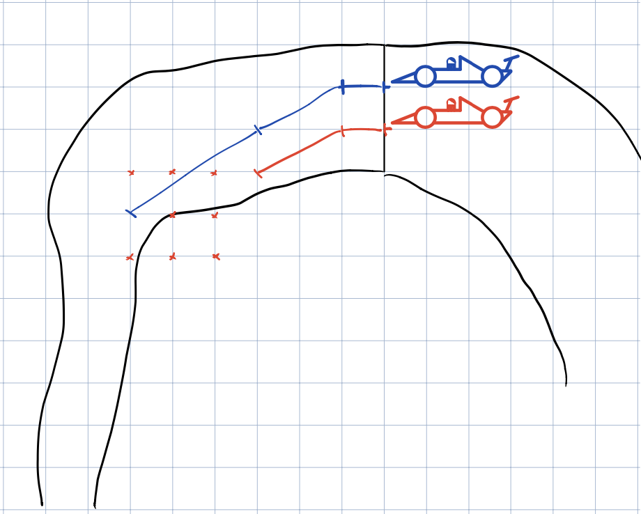

# Idea

The underlying idea of **RaceTrack** is a round-based racing game where the player has to strategically choose his/her next move out of multiple reachable positions. These positions are calculated based on the previous turn of the player. By relating the diffenerent turns, the game gets interessting and challenging. The player will be needed to demonstrate all his strategical skills and carefullness to beat his opponent. The game can train different players foresight thinking and basic understanding of vector mathematics.

