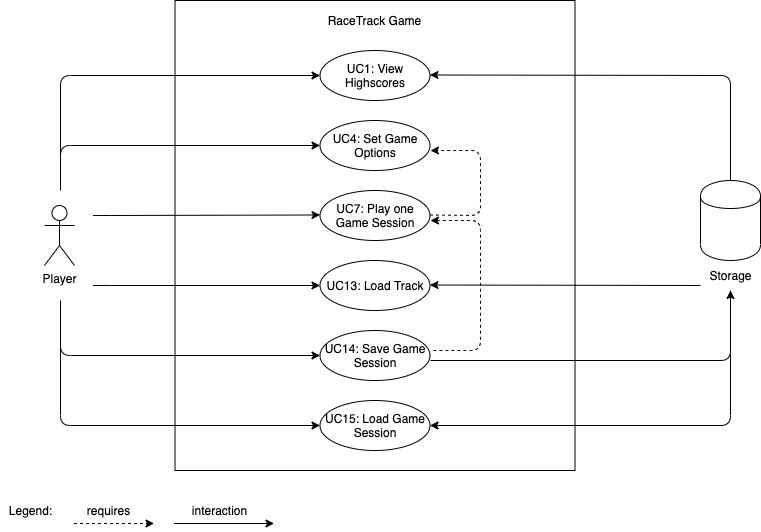
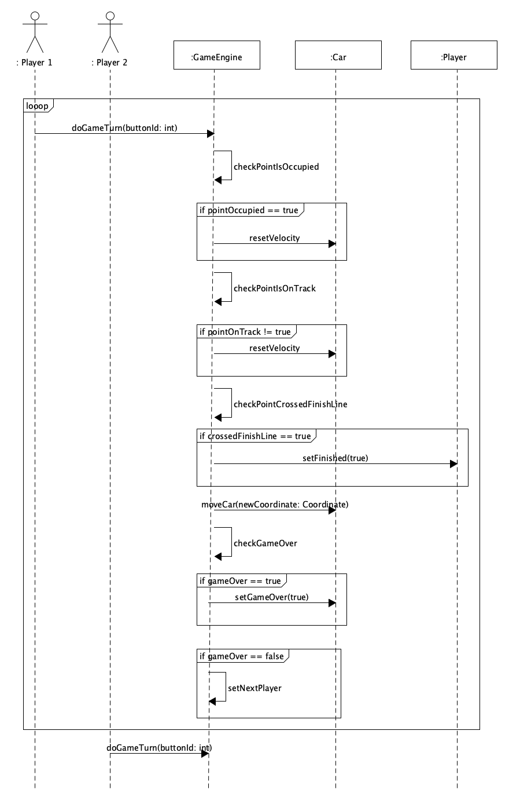
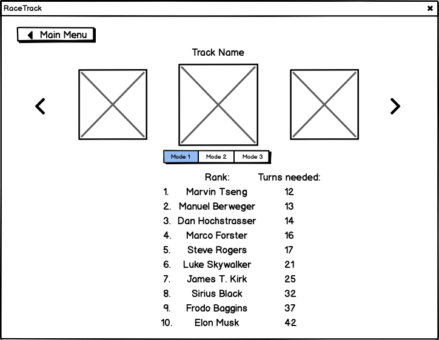
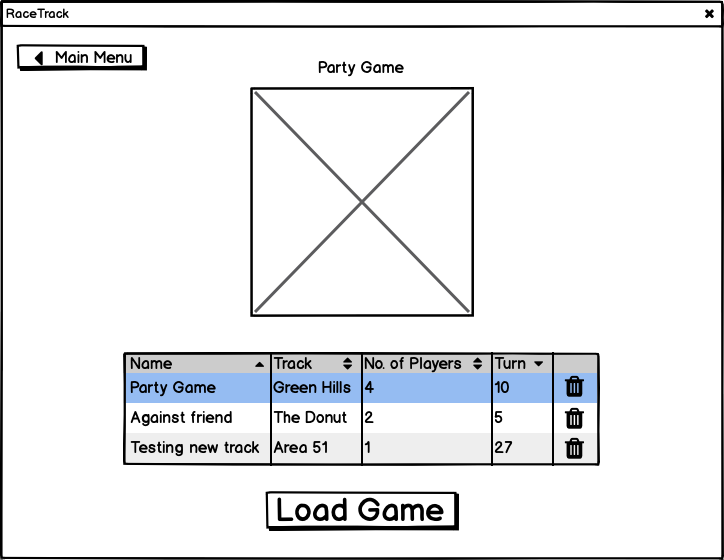

# Use Case Model

All identified use cases of RaceTrack are described in this section. Each use case is identified by an id in the form of **UC**n (e.g. UC1, UC2, ...). Use cases are added and removed during development, but don't change their ids during the entire development cycle (Reason why some use cases, e.g. UC2, don't exist anymore).

## Overview



## Main Use Cases

### Use Case UC7: Play one Game Session

| | |
|-|-|
| **Scope** | RaceTrack Game |
| **Level** | User Goal |
| **Primary Actor** | Player |
| **Stakeholders and Interests** | Player: Wants to play one game session of RaceTrack, either alone or with up to three friends. |
| **Preconditions** | A track has been loaded (UC13) and the game session has been successfully started with the player's settings (UC4). |
| **Success Guarantee** | The game session has been successfully played. Every player has reached the finish line, or the game has been ended after the first player had reached the goal. |
| **Frequency of Occurrence** | Once for every game session played. |

#### Main Success Scenario

1. The session starts and each player's car is placed on the starting line.
2. The player is given a total of maximum 9 possible moves he can choose for his car during his turn.
   1. The possible moves for the player's car are calculated before each turn, based on the player's velocity, previous turns and potential obstacles on the track (e.g. another player's car).
   2. With each move the player can accelerate, decelerate or maintain his current velocity.
   3. All possible moves for the player are shown on the track.
3. The player chooses his move out of the possible moves.
4. The player's car drives to the selected position on the track.

*Each player repeats steps 2. - 4. for his turn, until the first player reaches the finish line.*

5. The players are given the choice to continue the session until every other player reaches the finish line or to end the game now.
   1. If the choice is made to continue the session, every remaining player will continue to repeat steps 2. - 4. until everyone has reached the finish line.
6. The session ends and the scores of the just finished race are displayed.
7. The players can restart another session with the same settings or return to the main menu.

#### Alternative Flows

1. At any time, a player drives past the track limits:
    1. When the option *Continue with minimum velocity and no acceleration until the track is reached again* is selected during game creation:
        1. The player's velocity resets.
        2. The player does not accelerate until the track is reached again.
    2. When the option *Retire from the race* is selected during game creation:
        1. The player *crashes* and receives a corresponding notification about it.
        2. The player retires from the race and will not be able to do any more moves during this game session.
    3. When the option *Reset position to last valid point and reset velocity* is selected during game creation:
        1. The player *crashes* and receives a corresponding notification about it.
        2. The player's velocity resets.
        3. The player's car resets to his last valid position on the track.
2. At any time, a player can drive to a position already occupied by another player:

    1. The game calculates the player's possible moves and realises that some possible moves are already occupied by another player.
    2. The game will not show the invalid move to the player as one of the next possible moves anymore.
3. When *special items* have been selected as an option while starting the game:

    1. Special items e.g. boosts or obstacles are being randomly placed across the track.
    2. When driving on to a special item, it's special ability will be activated.

#### Special Requirements

- Recognisable assets. Cars, track limits, special items and the finish line must be easily recognisable.
- The car's movement has to be smooth.


#### Technology and Data Variations List

- Player input entered by mouse click or keyboard.

#### System Sequence Diagram



Each *gameMode* results in a different outcome when a *crash* happens:

- **gameMode 0:** *Continue with minimum velocity and no cceleration until the track is reached again.*

- **gameMode 1:** *Retire from the race.*

- **gameMode 2:** *Reset position to last valid point and reset velocity.*

#### UI Sketch


### Use Case UC13: Load Track

| | |
|-|-|
| **Scope** | RaceTrack Game |
| **Level** | User Goal |
| **Primary Actor** | Player |
| **Stakeholders and Interests** | Player: Wants to load a track from a bitmap image. |
| **Preconditions** | A bitmap image that complies with all specifications for a track file (see *Special Requirements*). |
| **Success Guarantee** | The track has been successfully loaded into the game and no errors have occured during the upload process. |
| **Frequency of Occurrence** | Once for each new track uploaded. |

#### Main Success Scenario

1. The player selects the *Load Track* entry in the main menu.
2. The player selects a valid bitmap image, which complies with all specifications for a track file (see *Special Requirements*), and uploads it into the game.
3. The game verifies the file for a valid track and responds correspondingly if the process has been successful or not.
4. After the file has been uploaded, the track can be chosen during the set-up of a new game session (UC4).

5. The player can upload another track or return to the main menu.

#### Alternative Flows

1. When the verification of the image as a track fails:
   1. The game will respond with a comprehensible error message that the image can not be verified as a track.
   2. The player will be given the opportunity to retry the upload process with another image or to return to the main menu.

#### Special Requirements

- The bitmap image needs to comply with these specifications or else the game will not be able to verified it as a track:
  - The image must only consist of following colors *(can still be changed during development)*:
    
    - <span style="color: #C5C5C5">**#C5C5C5**</span> - represents the drivable track.
    - <span style="color: #000000">**#000000**</span>/<span style="color: #FFFFFF; background-color: #000000">**#FFFFFF**</span> - represents the start/finish line. 
    
    - Every other color will be interpreted as not to be part of the drivable track (out of track boundaries).
  
- Below is an example of a correct bitmap image:


#### Technology and Data Variations List

- The bitmap file needs to be of the file format *PNG*

#### System Sequence Diagram


#### UI Sketch


## Secondary Use Cases

### Use Case UC1: View Highscores

|                                |                                                              |
| ------------------------------ | ------------------------------------------------------------ |
| **Scope**                      | RaceTrack Game                                               |
| **Level**                      | User Goal                                                    |
| **Primary Actor**              | Player                                                       |
| **Stakeholders and Interests** | Player: Wants to look at the highscores of a particular track. |
| **Preconditions**              | Atleast one game session has already been played on the track (UC7), else there are no scores to be displayed for the track. |
| **Success Guarantee**          | The highscores of the track are successfully shown.          |
| **Frequency of Occurrence**    | Everytime the player selects the *View Highscores* button in the main menu. |

#### Main Success Scenario

1. The player selects the *View Highscores* entry in the main menu.
2. The player chooses for which track the highscores should be displayed.
3. The player chooses for which game mode the highscores should be displayed.
   1. There are three available game modes that can be chosen during the creation of a new game session (UC4).
4. The top 10 scores for the particular track will be shown.
5. The player can choose another track for it's highscores or return to the main menu.

#### Alternative Flows

1. When a game session finishes:
   1. The scoreboard for the just finished game session will be displayed
   2. In the scoreboard, the scores of the participated players will be displayed with the current highscores of the track, that just has been played on.

#### Special Requirements

- Atleast one round must have been completed on the track, before highscores can be displayed.
- The game session must be completed, before its scores get written to the highscores.

#### Technology and Data Variations List

- The highscores are saved in a *.rtsave* file.
- The *.rtsave* file follows the JSON syntax.

#### UI Sketch



### Use Case UC4: Set Game Options

|                                |                                                              |
| ------------------------------ | ------------------------------------------------------------ |
| **Scope**                      | RaceTrack Game                                               |
| **Level**                      | User Goal                                                    |
| **Primary Actor**              | Player                                                       |
| **Stakeholders and Interests** | Player: Wants to configure the options for the coming game session (UC7). |
| **Preconditions**              | No running game session at the moment.                       |
| **Success Guarantee**          | The preferences entered by the user are successfully applied to the created game session. |
| **Frequency of Occurrence**    | Once before each new game session.                           |

#### Main Success Scenario

1. The player selects the *New Game* entry in the main menu.
2. The player configures the settings for the new game session to his liking.
   1. The player defines for each participating player the name and car color.
   2. The player defines how the game should handle crashes by selecting one out of three available game modes:
      1. *Continue with minimum velocity and no acceleration until the track is reached again*.
      2. *Retire from the race*.
      3. *Reset position to last valid point and reset velocity*.
   3. The player selects the track to be played on.
3. The player finishes the setup for a new game session by clicking on the *Start Game* button.

#### Alternative Flows

1. When not all four player fields are filled out during game setup:
   1. The game starts the session with only filled out players, players with no name are ignored.

2. When the player wants to return to the main menu:
   1. The player clicks on the *Main Menu* button in the game window.
   2. The player returns to the man menu.

#### Special Requirements

- The settings must be easily understandable.
- Language internationalisation on the text displayed.
- Only previously loaded tracks (UC13) can be chosen during game setup.

#### Technology and Data Variations List

- The settings for the game session must be saved in a *.rtsave* file.
- The *.rtsave* file follows the JSON syntax.

#### UI Sketch


### Use Case UC14: Save Game Session

| | |
|-|-|
| **Scope** | RaceTrack Game |
|-|-|
| **Level** | User Goal |
| **Primary Actor** | Player |
| **Stakeholders and Interests** | Player: Wants to save a running game session (UC7) that hasn't been saved yet. |
| **Preconditions** | A currently running game session (UC7). |
| **Success Guarantee** | A running game session has been successfully saved in a *.rtsave* file. |
| **Frequency of Occurrence** | Usually once per game session. |

#### Main Success Scenario

1. A game session is currently being played (UC7).
3. The player selects *Save Game* entry in the menu at the bottom of the game window.
4. The game shows a success message to the player, that the session has been successfully saved.

#### Alternative Flows

1. Any time the player wants to delete a previously saved game session:
   1. The player is currently in the main menu of the game.
   2. The player selects *Load Game* in the main menu.
   3. Instead to *load* the selected game session, the player chooses to *delete* the saved game session.
   4. The player then can delete another saved game session or return to the main menu.

#### Special Requirements

* All information needed to save the current game state must be included in the save file.

#### Technology and Data Variations List

- The resulting file that gets created with a save must have the extension *.rtsave*.
- The *.rtsave* file must follow the JSON syntax.
- Below is an example of such a *.rtsave* file:

```json
{
	"track":
		{
			"name": "Example 1",
      "file": "./track/example_track1.png"
		},
	"players": [
		{
			"name": "Marco",
			"car":
      	{
        	"color": "#00FF00",
        	"position": "(13,3)",
        	"velocity": "(5,5)",
        	"route": [
          	"(13,3)",
          	"(10,2)"
        	]
      	}
    },
    {
			"name": "Manuel",
			"car":
      	{
        	"color": "#0000FF",
        	"position": "(14,3)",
        	"velocity": "(5,5)",
        	"route": [
          	"(14,3)",
          	"(9,1)"
        	]
      	}
		}
  ],
  "startFinishLine":
  	{
      "position":
      	[
          "(5,1)",
          "(5,2)",
          "(5,3)"
        ]
    }
}
```

#### UI-Sketch

*Already visible on the UI-Sketch for Use Case UC1: Play one Game Session*

### Use Case UC15: Load Game Session

|                                |                                                              |
| ------------------------------ | ------------------------------------------------------------ |
| **Scope**                      | RaceTrack Game                                               |
| **Level**                      | User Goal                                                    |
| **Primary Actor**              | Player                                                       |
| **Stakeholders and Interests** | Player: Wants to load a previously saved game session.       |
| **Preconditions**              | A valid *.rtsave* file containing all the necessary informations to restore a past game session. |
| **Success Guarantee**          | A saved game session has been successfully loaded from a *.rtsave* file. |
| **Frequency of Occurrence**    | Once per saved game session to load.                         |

#### Main Success Scenario

1. The player is currently in the main menu of the game.
2. The player selects *Load Game* in the main menu.
3. The player chooses one of the previously saved game sessions in the list to be loaded.
4. The previously game session is being loaded with the same state as saved.
5. The loaded game session can now be continued.

#### Alternative Flows

*No alternative flows present.*

#### Special Requirements

* When the save file is loaded, the game state should excatly be the same as before.

#### Technology and Data Variations List

- The resulting file that gets loaded must have the extension *.rtsave*.

#### UI-Sketch



