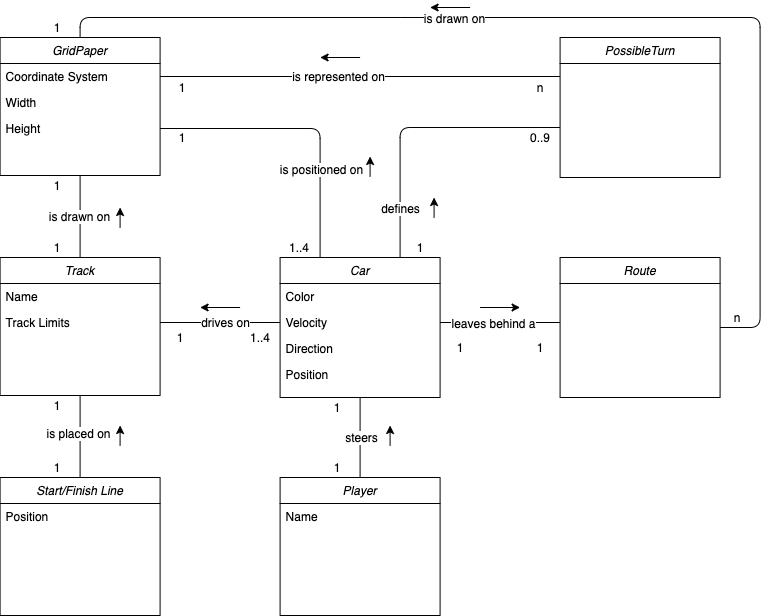

# Domain Model

The *Track*, with a *Start/Finish Line* placed on it, is drawn on the *GridPaper*. There are between one and four cars that drive on the *Track*. Each *Car* is being steered by a *Player*. A *Car* is always being positioned on the *GridPaper*. The *Car* defines it's *PossibleTurn* throgh his velocity and direction. Each *PosssibleTurn* is represented on the *GridPaper* itself. While driving, the *Car* leaves behind a *Route*, which is also drawn on the *GridPaper*.

