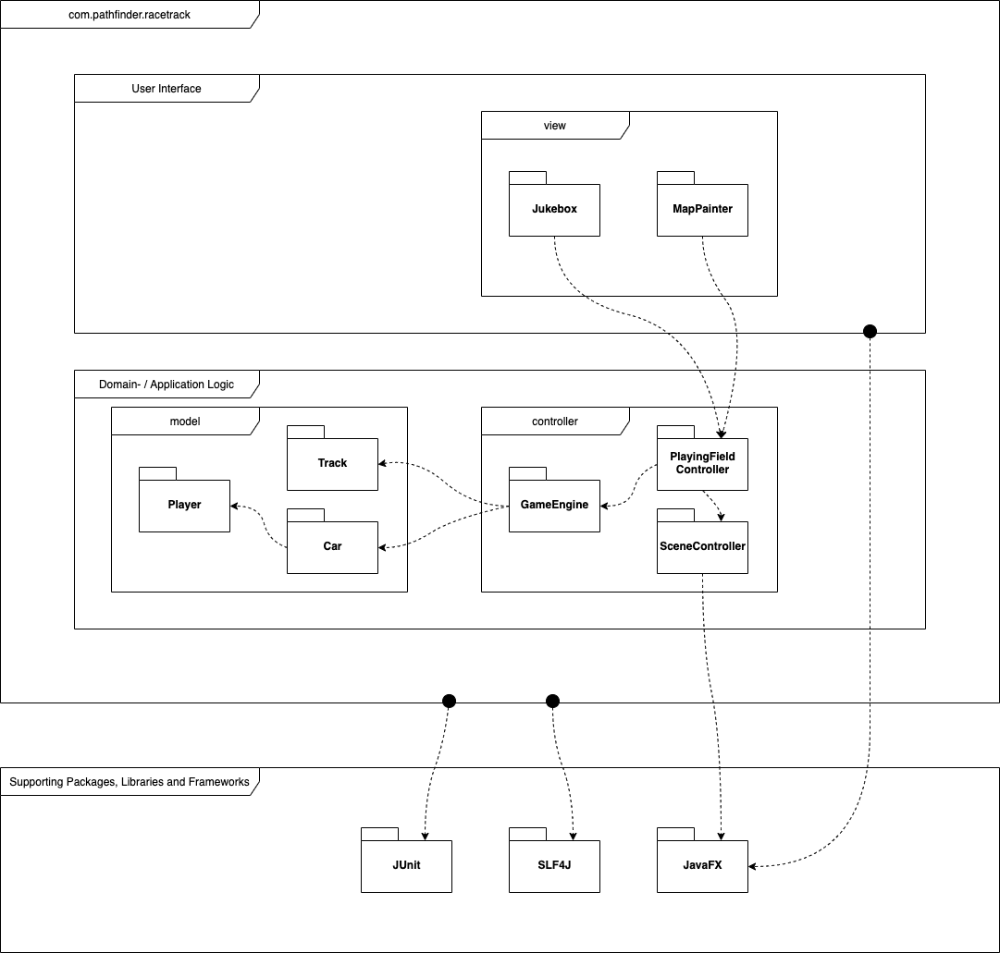

# Software Architecture

As there weren't any special architectural requirements needed for RaceTrack, it was decided to opt for a special **layered architecture** by using concepts of the proven **MVC Pattern** (Model-View-Controller).

<i>Standard implementation of the MVC Pattern in an application</i>

For the development of RaceTrack, the UI will be seperated from the model and application logic. This layered architecture will be used to seperate the application's concerns into three stages:

-  - View represents the visualization of the data that model contains
  *(package com.pathfinder.racetrack.view)*.

-  - Controller acts on both model and view. It controls the data flow into model object and updates the view whenever data changes. It keeps view and model separate
  *(package com.pathfinder.racetrack.controller)*.
-  - Model represents an object or Java POJO carrying data. It can also have logic to update controller if its data changes *(package com.pathfinder.racetrack.model)*.

Not only does this abstraction of the MVC Pattern seperate the different aspects of the application, it also provides loose coupling between these elements. The UI logic belongs in the view, input logic belongs in the controller and business logic belongs in the model. MVC also enables high cohesion by logically grouping related actions on a controller together and also groups the views for a specific model together. Because of the separation of responsibilities, future development or modification is also easier. This alteration of the original MVC concepts will also be easier to implement in a game, as a pure implementation of the MVC Pattern is really difficult to implement using Java and especially JavaFX.

**Package Diagram:**

## Distribution Model

As RaceTrack will be played on a single device, there isn't any need for a distribution model. But the game will be implemented to allow distributed sessions (Peer-to-Peer) in the future.

