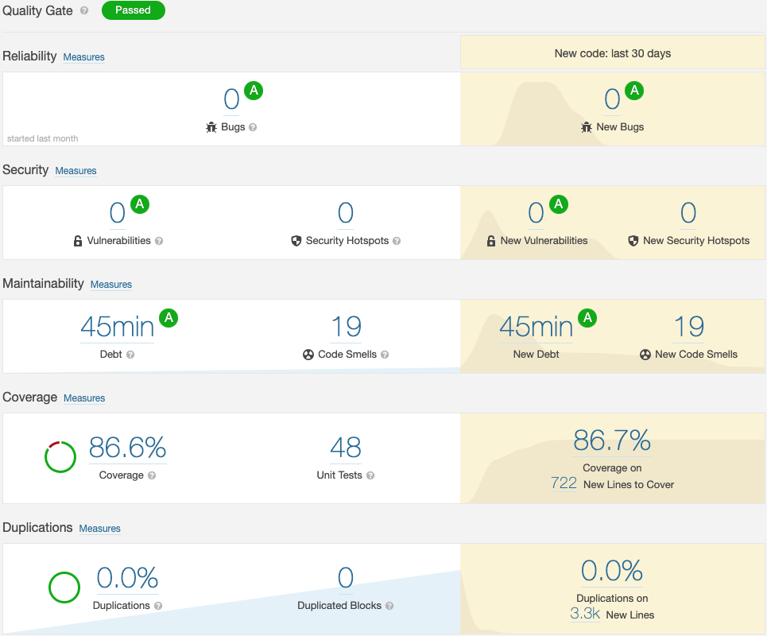
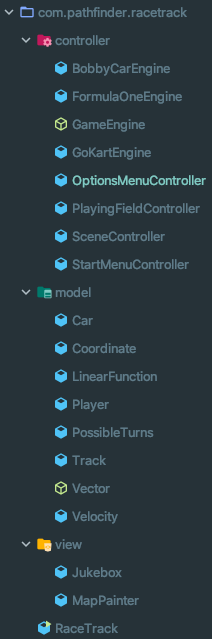
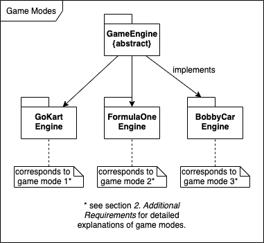
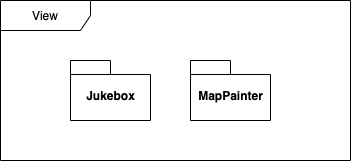
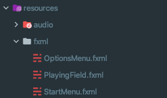

# Implementation

## Ensuring of Code Quality

RaceTrack is being developed using the leading cloud-based solution for continuous analysis of code quality, reliability and security *SonarCloud*. Not only does *SonarCloud* automatically detect bugs, vulnerabilities, code smells and other issues, it also elevates the team's coding quality to a new standard. 

RaceTrack currently maintains the highest Reliability Rating <b>A</b>, the highest Security Rating <b>A</b> and an outstanding Test Coverage of <b>86.6%</b>, and all of that still during the development of the first prototype, with only room for further improvement.

In the current build version of RaceTrack, there are currently only 19 *code smells* (code that is confusing or difficult to maintain), of which 18 are about *Todos* still left in the code. The only critical *code smell* is about the method *findFinishLine()*, which has a very high cognitive complexity level, which can be reduced.

## Code Implementation

As described in section *4. Software Architecture*, RaceTrack implements a custom alteration of the MVC Pattern, which can also be taken from the package structure in the source code itself:

### Package com.pathfinder.racetrack.controller

A *GameEngine* represents the brain of a game session, each game mode (currently three in total) extends the abstract class *GameEngine* with its own extensions. There are currently three game modes available.

Player input through the GUI is handled by the *controllers*. Each controller is responsible for a different section of the GUI (e.g. *StartMenuController* for input in the main menu), except for the *SceneController*, which manages what menu is currently viewed by the player.

### Package com.pathfinder.racetrack.model

As per layered architecture, the models are being updated through the controller, a *GameEngine* in RaceTrack to be exact. But there are still some connections and dependencies between the models themselves: e.g. *Velocity* and *Coordinate* both extend the abstract class *Vector*, which are used by *Car*, which is also owned by a *Player*.

### Package com.pathfinder.racetrack.view

The *View* package currently only holds the classes *Jukebox* and *MapPainter*, which are both only supporting classes for the actual user interfaces (*Jukebox* for adding sounds effects and *MapPainter* for drawing the playing field).

The actual interfaces are being builded by **JavaFX** through *.fxml* files, which are located in the *resources* directory in the source code.

## Verification

The software architecture has been verified by (partially) implementing both main use cases **UC7 (Play one Game Session)** and **UC13 (Load Track)**. Tracks can only be loaded through the command line at the moment.

## Source Code

The complete source code (including Unit Tests) can be found attached to this documentation *Solution-Architecture_PSIT3-FS20-IT18ta_WIN_Team5.zip* or on GitHub (https://github.zhaw.ch/PathFinder/PSIT3-FS20-IT18ta_WIN-Team5).

