# Solution Architecture

<div style="page-break-after: always;"></div>

# Table of Contents

[TOC]

<div style="page-break-after: always;"></div>

# 1. Use Case Model

All identified use cases of RaceTrack are described in this section. Each use case is identified by an id in the form of **UC**n (e.g. UC1, UC2, ...). Use cases are added and removed during development, but don't change their ids during the entire development cycle (Reason why some use cases, e.g. UC2, don't exist anymore).

## 1.1. Overview

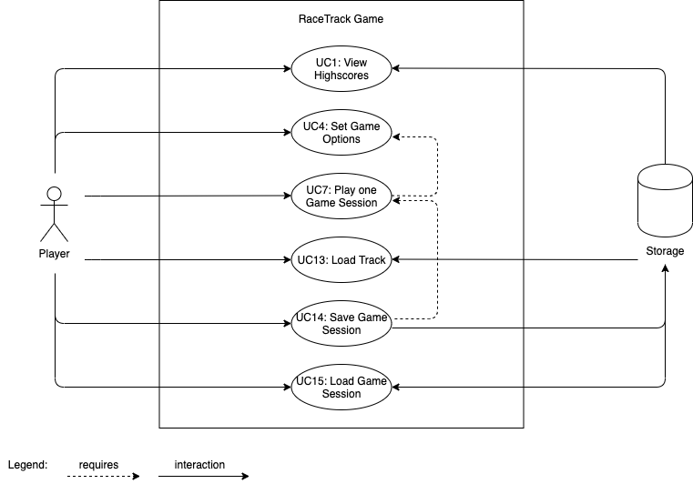

<div style="page-break-after: always;"></div>

## 1.2. Main Use Cases

### 1.2.1. Use Case UC7: Play one Game Session

| | |
|-|-|
| **Scope** | RaceTrack Game |
| **Level** | User Goal |
| **Primary Actor** | Player |
| **Stakeholders and Interests** | Player: Wants to play one game session of RaceTrack, either alone or with up to three friends. |
| **Preconditions** | A track has been loaded (UC13) and the game session has been successfully started with the player's settings (UC4). |
| **Success Guarantee** | The game session has been successfully played. Every player has reached the finish line, or the game has been ended after the first player had reached the goal. |
| **Frequency of Occurrence** | Once for every game session played. |

#### 1.2.1.1. Main Success Scenario

1. The session starts and each player's car is placed on the starting line.
2. The player is given a total of maximum 9 possible moves he can choose for his car during his turn.
   1. The possible moves for the player's car are calculated before each turn, based on the player's velocity, previous turns and potential obstacles on the track (e.g. another player's car).
   2. With each move the player can accelerate, decelerate or maintain his current velocity.
   3. All possible moves for the player are shown on the track.
3. The player chooses his move out of the possible moves.
4. The player's car drives to the selected position on the track.

*Each player repeats steps 2. - 4. for his turn, until the first player reaches the finish line.*

5. The players are given the choice to continue the session until every other player reaches the finish line or to end the game now.
   1. If the choice is made to continue the session, every remaining player will continue to repeat steps 2. - 4. until everyone has reached the finish line.
6. The session ends and the scores of the just finished race are displayed.
7. The players can restart another session with the same settings or return to the main menu.

<div style="page-break-after: always;"></div>

#### 1.2.1.2. Alternative Flows

1. At any time, a player drives past the track limits:
    1. When the option *Continue with minimum velocity and no acceleration until the track is reached again* is selected during game creation:
        1. The player's velocity resets.
        2. The player does not accelerate until the track is reached again.
    2. When the option *Retire from the race* is selected during game creation:
        1. The player *crashes* and receives a corresponding notification about it.
        2. The player retires from the race and will not be able to do any more moves during this game session.
    3. When the option *Reset position to last valid point and reset velocity* is selected during game creation:
        1. The player *crashes* and receives a corresponding notification about it.
        2. The player's velocity resets.
        3. The player's car resets to his last valid position on the track.
2. At any time, a player can drive to a position already occupied by another player:

    1. The game calculates the player's possible moves and realises that some possible moves are already occupied by another player.
    2. The game will not show the invalid move to the player as one of the next possible moves anymore.
3. When *special items* have been selected as an option while starting the game:

    1. Special items e.g. boosts or obstacles are being randomly placed across the track.
    2. When driving on to a special item, it's special ability will be activated.

#### 1.2.1.3. Special Requirements

- Recognisable assets. Cars, track limits, special items and the finish line must be easily recognisable.
- The car's movement has to be smooth.


#### 1.2.1.4. Technology and Data Variations List

- Player input entered by mouse click or keyboard.

<div style="page-break-after: always;"></div>

#### 1.2.1.5. System Sequence Diagram

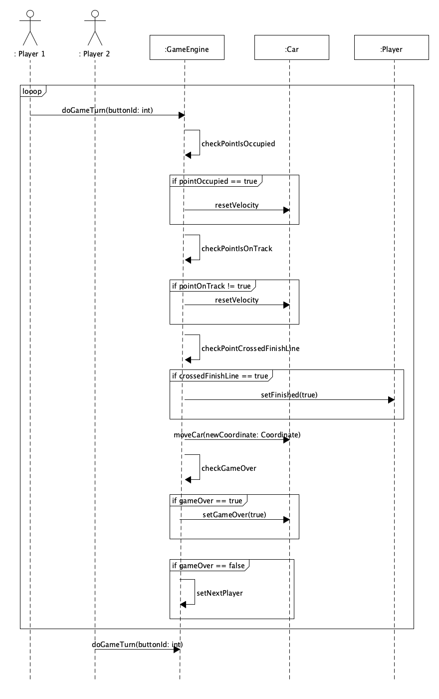

Each *gameMode* results in a different outcome when a *crash* happens:

- **gameMode 0:** *Continue with minimum velocity and no cceleration until the track is reached again.*

- **gameMode 1:** *Retire from the race.*
- **gameMode 2:** *Reset position to last valid point and reset velocity.*

<div style="page-break-after: always;"></div>

#### 1.2.1.6. UI Sketch

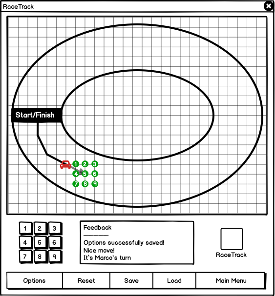

<div style="page-break-after: always;"></div>

### 1.2.2. Use Case UC13: Load Track

| | |
|-|-|
| **Scope** | RaceTrack Game |
| **Level** | User Goal |
| **Primary Actor** | Player |
| **Stakeholders and Interests** | Player: Wants to load a track from a bitmap image. |
| **Preconditions** | A bitmap image that complies with all specifications for a track file (see *Special Requirements*). |
| **Success Guarantee** | The track has been successfully loaded into the game and no errors have occured during the upload process. |
| **Frequency of Occurrence** | Once for each new track uploaded. |

#### 1.2.2.1. Main Success Scenario

1. The player selects the *Load Track* entry in the main menu.
2. The player selects a valid bitmap image, which complies with all specifications for a track file (see *Special Requirements*), and uploads it into the game.
3. The game verifies the file for a valid track and responds correspondingly if the process has been successful or not.
4. After the file has been uploaded, the track can be chosen during the set-up of a new game session (UC4).
5. The player can upload another track or return to the main menu.

#### 1.2.2.2. Alternative Flows

1. When the verification of the image as a track fails:
   1. The game will respond with a comprehensible error message that the image can not be verified as a track.
   2. The player will be given the opportunity to retry the upload process with another image or to return to the main menu.

#### 1.2.2.3. Special Requirements

- The bitmap image needs to comply with these specifications or else the game will not be able to verified it as a track:
  - The image must only consist of following colors *(can still be changed during development)*:
    
    - <span style="color: #C5C5C5">**#C5C5C5**</span> - represents the drivable track.
    - <span style="color: #000000">**#000000**</span>/<span style="color: #FFFFFF; background-color: #000000">**#FFFFFF**</span> - represents the start/finish line. 
    - Every other color will be interpreted as not to be part of the drivable track (out of track boundaries).
  

<div style="page-break-after: always;"></div>

- Below is an example of a correct bitmap image:

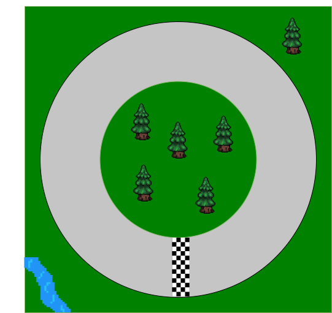

#### 1.2.2.4. Technology and Data Variations List

- The bitmap file needs to be of the file format *PNG*

#### 1.2.2.5. System Sequence Diagram

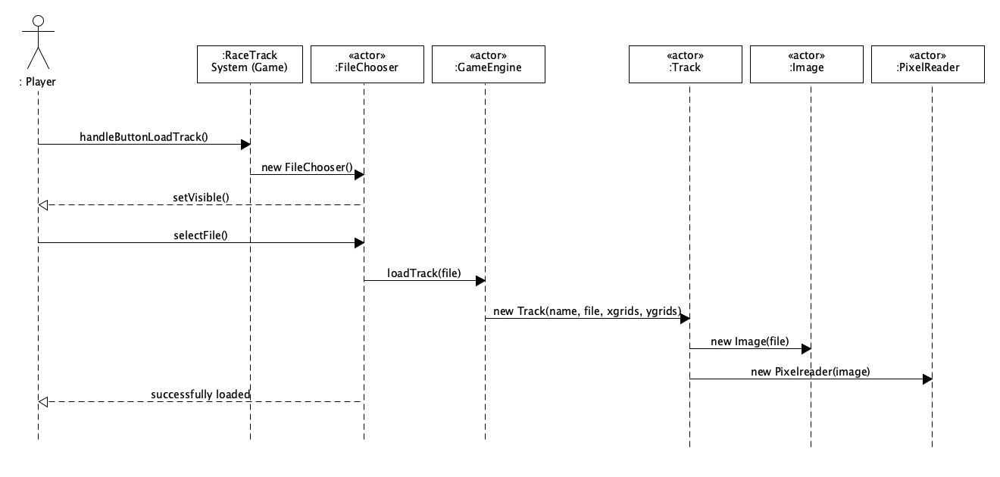{ width=90% }

<div style="page-break-after: always;"></div>

#### 1.2.2.6. UI Sketch

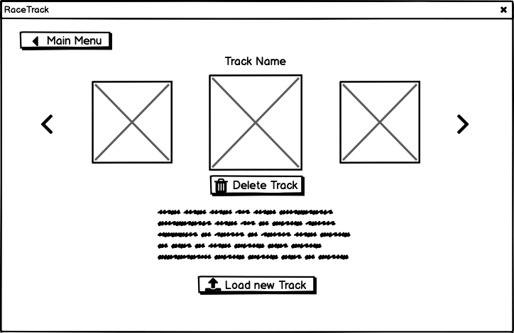

<div style="page-break-after: always;"></div>

## 1.3. Secondary Use Cases

### 1.3.1. Use Case UC1: View Highscores

|                                |                                                              |
| ------------------------------ | ------------------------------------------------------------ |
| **Scope**                      | RaceTrack Game                                               |
| **Level**                      | User Goal                                                    |
| **Primary Actor**              | Player                                                       |
| **Stakeholders and Interests** | Player: Wants to look at the highscores of a particular track. |
| **Preconditions**              | Atleast one game session has already been played on the track (UC7), else there are no scores to be displayed for the track. |
| **Success Guarantee**          | The highscores of the track are successfully shown.          |
| **Frequency of Occurrence**    | Everytime the player selects the *View Highscores* button in the main menu. |

#### 1.3.1.1. Main Success Scenario

1. The player selects the *View Highscores* entry in the main menu.
2. The player chooses for which track the highscores should be displayed.
3. The player chooses for which game mode the highscores should be displayed.
   1. There are three available game modes that can be chosen during the creation of a new game session (UC4).
4. The top 10 scores for the particular track will be shown.
5. The player can choose another track for it's highscores or return to the main menu.

#### 1.3.1.2. Alternative Flows

1. When a game session finishes:
   1. The scoreboard for the just finished game session will be displayed
   2. In the scoreboard, the scores of the participated players will be displayed with the current highscores of the track, that just has been played on.

#### 1.3.1.3. Special Requirements

- Atleast one round must have been completed on the track, before highscores can be displayed.
- The game session must be completed, before its scores get written to the highscores.

#### 1.3.1.4. Technology and Data Variations List

- The highscores are saved in a *.rtsave* file.
- The *.rtsave* file follows the JSON syntax.

<div style="page-break-after: always;"></div>

#### 1.3.1.5. UI Sketch

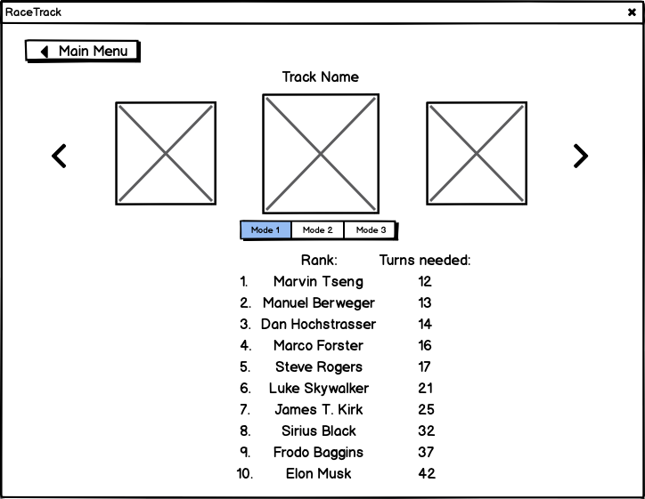

### 1.3.2. Use Case UC4: Set Game Options

|                                |                                                              |
| ------------------------------ | ------------------------------------------------------------ |
| **Scope**                      | RaceTrack Game                                               |
| **Level**                      | User Goal                                                    |
| **Primary Actor**              | Player                                                       |
| **Stakeholders and Interests** | Player: Wants to configure the options for the coming game session (UC7). |
| **Preconditions**              | No running game session at the moment.                       |
| **Success Guarantee**          | The preferences entered by the user are successfully applied to the created game session. |
| **Frequency of Occurrence**    | Once before each new game session.                           |

#### 1.3.2.1. Main Success Scenario

1. The player selects the *New Game* entry in the main menu.
2. The player configures the settings for the new game session to his liking.
   1. The player defines for each participating player the name and car color.
   2. The player defines how the game should handle crashes by selecting one out of three available game modes:
      1. *Continue with minimum velocity and no acceleration until the track is reached again*.
      2. *Retire from the race*.
      3. *Reset position to last valid point and reset velocity*.
   3. The player selects the track to be played on.
3. The player finishes the setup for a new game session by clicking on the *Start Game* button.

#### 1.3.2.2. Alternative Flows

1. When not all four player fields are filled out during game setup:
   1. The game starts the session with only filled out players, players with no name are ignored.

2. When the player wants to return to the main menu:
   1. The player clicks on the *Main Menu* button in the game window.
   2. The player returns to the man menu.

#### 1.3.2.3. Special Requirements

- The settings must be easily understandable.
- Language internationalisation on the text displayed.
- Only previously loaded tracks (UC13) can be chosen during game setup.

#### 1.3.2.4. Technology and Data Variations List

- The settings for the game session must be saved in a *.rtsave* file.
- The *.rtsave* file follows the JSON syntax.

#### 1.3.2.5. UI Sketch

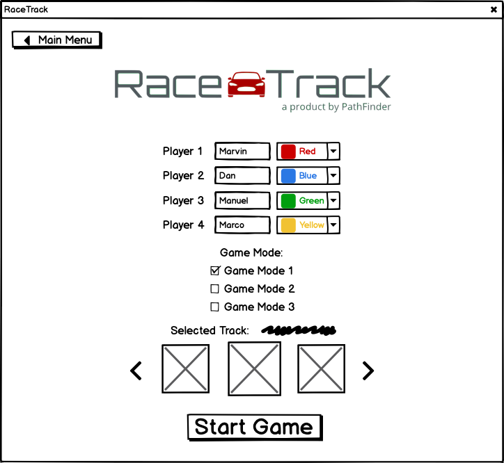

<div style="page-break-after: always;"></div>

### 1.3.3. Use Case UC14: Save Game Session

| | |
|-|-|
| **Scope** | RaceTrack Game |
|-|-|
| **Level** | User Goal |
| **Primary Actor** | Player |
| **Stakeholders and Interests** | Player: Wants to save a running game session (UC7) that hasn't been saved yet. |
| **Preconditions** | A currently running game session (UC7). |
| **Success Guarantee** | A running game session has been successfully saved in a *.rtsave* file. |
| **Frequency of Occurrence** | Usually once per game session. |

#### 1.3.3.1. Main Success Scenario

1. A game session is currently being played (UC7).
3. The player selects *Save Game* entry in the menu at the bottom of the game window.
4. The game shows a success message to the player, that the session has been successfully saved.

#### 1.3.3.2. Alternative Flows

1. Any time the player wants to delete a previously saved game session:
   1. The player is currently in the main menu of the game.
   2. The player selects *Load Game* in the main menu.
   3. Instead to *load* the selected game session, the player chooses to *delete* the saved game session.
   4. The player then can delete another saved game session or return to the main menu.

#### 1.3.3.3. Special Requirements

* All information needed to save the current game state must be included in the save file.

#### 1.3.3.4. Technology and Data Variations List

- The resulting file that gets created with a save must have the extension *.rtsave*.
- The *.rtsave* file must follow the JSON syntax.
- Below is an example of such a *.rtsave* file:

<div style="page-break-after: always;"></div>

```json
{
	"track":
		{
			"name": "Example 1",
      "file": "./track/example_track1.png"
		},
	"players": [
		{
			"name": "Marco",
			"car":
      	{
        	"color": "#00FF00",
        	"position": "(13,3)",
        	"velocity": "(5,5)",
        	"route": [
          	"(13,3)",
          	"(10,2)"
        	]
      	}
    },
    {
			"name": "Manuel",
			"car":
      	{
        	"color": "#0000FF",
        	"position": "(14,3)",
        	"velocity": "(5,5)",
        	"route": [
          	"(14,3)",
          	"(9,1)"
        	]
      	}
		}
  ],
  "startFinishLine":
  	{
      "position":
      	[
          "(5,1)",
          "(5,2)",
          "(5,3)"
        ]
    }
}
```

#### 1.3.3.5. UI-Sketch

*Already visible on the UI-Sketch for Use Case UC1: Play one Game Session*

<div style="page-break-after: always;"></div>

### 1.3.4. Use Case UC15: Load Game Session

|                                |                                                              |
| ------------------------------ | ------------------------------------------------------------ |
| **Scope**                      | RaceTrack Game                                               |
| **Level**                      | User Goal                                                    |
| **Primary Actor**              | Player                                                       |
| **Stakeholders and Interests** | Player: Wants to load a previously saved game session.       |
| **Preconditions**              | A valid *.rtsave* file containing all the necessary informations to restore a past game session. |
| **Success Guarantee**          | A saved game session has been successfully loaded from a *.rtsave* file. |
| **Frequency of Occurrence**    | Once per saved game session to load.                         |

#### 1.3.4.1. Main Success Scenario

1. The player is currently in the main menu of the game.
2. The player selects *Load Game* in the main menu.
3. The player chooses one of the previously saved game sessions in the list to be loaded.
4. The previously game session is being loaded with the same state as saved.
5. The loaded game session can now be continued.

#### 1.3.4.2. Alternative Flows

*No alternative flows present.*

#### 1.3.4.3. Special Requirements

* When the save file is loaded, the game state should excatly be the same as before.

#### 1.3.4.4. Technology and Data Variations List

- The resulting file that gets loaded must have the extension *.rtsave*.

<div style="page-break-after: always;"></div>

#### 1.3.4.5. UI-Sketch

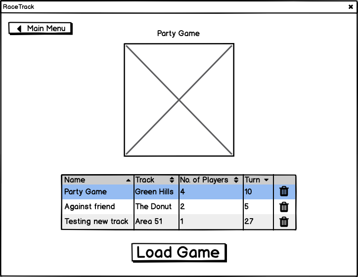

<div style="page-break-after: always;"></div>

# 2. Additional Requirements

## 2.1. Functionality

### 2.1.1. General

- The game will be played on the same device and GUI.
- The game will be implemented to allow distributed sessions in the future.

### 2.1.2. Game Rules

#### 2.1.2.1. Goal

The objective of the game is to be the first one to reach the finish line.

#### 2.1.2.2. Environment

The game board is a checkered piece of paper with a track, starting line and finish line. All the grid points on the track are accessible by the players with their respective moves.

#### 2.1.2.3. The Course of the game

All players start from the starting line. Player 1, who is registered first in RaceTrack, starts with the first move. After each move of a participant, the next competitor takes his turn until the first player reaches the finish line. After that, the players can choose to end the running game session at that moment or to continue until every other player also reaches the finish line. A finished player will not be able to move again.

##### 2.1.2.3.1. Moving around

Each player's first move must lead to one of the five neighbors of the starting point moving forward. On the first move, it is not possible to go backwards. In each following move, the so-called base for this move is determined. The base is dependent on repeating the previous move, both horizontally and vertically. This calculation in RaceTrack is also known as velocity in the game.

**Example**

> If the player last moved two boxes to the right and four boxes up, the main point is now two boxes to the right and four above the current starting point. The player now can move directly to the main point or one of his eight neighbors.

<div style="page-break-after: always;"></div>

##### 2.1.2.3.2. Conditions

The cars must stay within the track boundaries. This applies to every move. Leaving the road will lead to a crash. Depending on the selected game mode, the game will react differently to a crash. Points that are occupied by another car cannot be approached.

##### 2.1.2.3.3. Game Modes and Crash Handling

There are currently **three** unique game modes available:

**Game mode 1:** When the game mode *Continue with minimum velocity and no cceleration until the track is reached again* is selected during game creation:

1. The player's velocity resets.
2. The player does not accelerate until the track is reached again.

**Game mode 2:** When the game mode *Retire from the race* is selected during game creation:

1. The player *crashes* and receives a corresponding notification about it.
2. The player retires from the race and will not be able to do any more moves during this game session.

**Game mode 3:** When the game mode *Reset position to last valid point and reset velocity* is selected during game creation:

1. The player *crashes* and receives a corresponding notification about it.
2. The player's velocity resets.
3. The player's car resets to his last valid position on the track.

### 2.1.3. Special Requirements

Custom tracks to be loaded into the game (UC13) need to comply with following requirements:

- The image must only consist of following colors *(can still be changed during development)*:
  - <span style="color: #C5C5C5">**#C5C5C5**</span> - represents the drivable track.
  - <span style="color: #000000">**#000000**</span>/<span style="color: #FFFFFF; background-color: #000000">**#FFFFFF**</span> - represents the start/finish line. 

  - Every other color will be interpreted as not to be part of the drivable track (out of track boundaries).

## 2.2. Usability

RaceTrack's GUI must implement the fundamental concepts of usability to ensure a usable and accessible user experience. The following requirements are defined:

<div style="page-break-after: always;"></div>

1. Minimalistic GUI
   1. 9 simple buttons to steer the car
   2. A map to show
      1. The grid paper
      2. The Track
      3. Finish/start line
2. Target interaction components should be large enough for users to both discern what it is and to accurately select them.
   1. minimum of 24 Pixels in width and height for buttons
3. Provide user feedback if computation actions take longer than five seconds.

## 2.3. Reliability

The following reliability requirements are defined for RaceTrack.

- _Reliability_: 99.999% at 10'000 cycles
- _Failure definition_: A failed cycle is a session of RaceTrack which was interrupted by a crash of the application.

## 2.4. Performance

Due to the simple architecture of the application, no special performance requirements are defined. Notice the usability requirement number four, which requires the response time for user feedback to be in *normal* levels (< 1s).

## 2.5. Supportability

Serviceability requirements:

1. The Java code must be documented.
2. Clean code concepts will be integrated when developing RaceTrack (See PDF *PROG1 Clean-Code-Regeln*)
3. RaceTrack is developed using the [Semantic Versioning specification](https://semver.org/).

## 2.6. Scalability

There are no special requirements about scalability.

<div style="page-break-after: always;"></div>

# 3. Domain Model

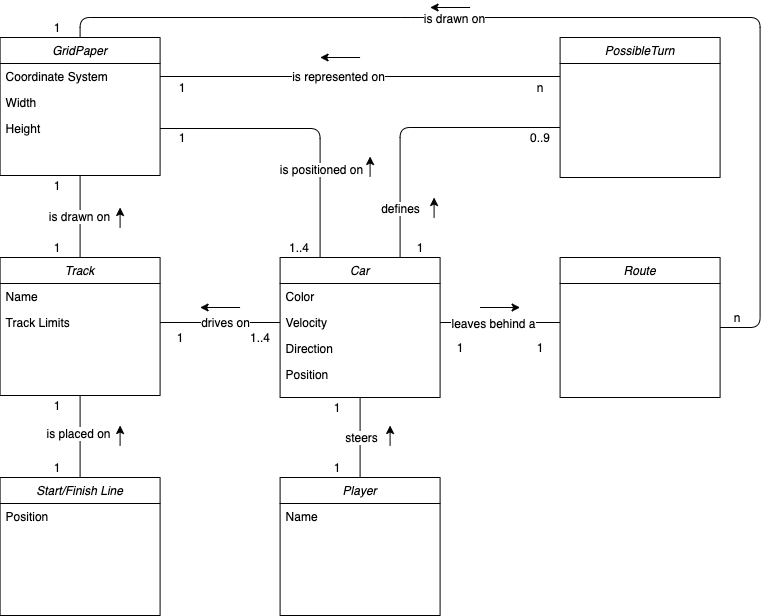{ width=90% }

The *Track*, with a *Start/Finish Line* placed on it, is drawn on the *GridPaper*. There are between one and four cars that drive on the *Track*. Each *Car* is being steered by a *Player*. A *Car* is always being positioned on the *GridPaper*. The *Car* defines it's *PossibleTurn* throgh his velocity and direction. Each *PosssibleTurn* is represented on the *GridPaper* itself. While driving, the *Car* leaves behind a *Route*, which is also drawn on the *GridPaper*.

<div style="page-break-after: always;"></div>

# 4. Software Architecture

As there weren't any special architectural requirements needed for RaceTrack, it was decided to opt for a special **layered architecture** by using concepts of the proven **MVC Pattern** (Model-View-Controller).

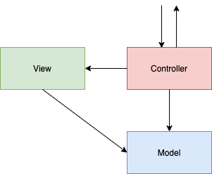

<center><i>Standard implementation of the MVC Pattern in an application</i></center>

For the development of RaceTrack, the UI will be seperated from the model and application logic. This layered architecture will be used to seperate the application's concerns into three stages:

-  - View represents the visualization of the data that model contains
  *(package com.pathfinder.racetrack.view)*.

-  - Controller acts on both model and view. It controls the data flow into model object and updates the view whenever data changes. It keeps view and model separate
  *(package com.pathfinder.racetrack.controller)*.
-  - Model represents an object or Java POJO carrying data. It can also have logic to update controller if its data changes *(package com.pathfinder.racetrack.model)*.

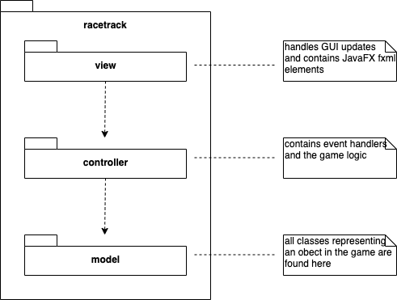

Not only does this abstraction of the MVC Pattern seperate the different aspects of the application, it also provides loose coupling between these elements. The UI logic belongs in the view, input logic belongs in the controller and business logic belongs in the model. MVC also enables high cohesion by logically grouping related actions on a controller together and also groups the views for a specific model together. Because of the separation of responsibilities, future development or modification is also easier. This alteration of the original MVC concepts will also be easier to implement in a game, as a pure implementation of the MVC Pattern is really difficult to implement using Java and especially JavaFX.

**Package Diagram:**

{ width=90% }

## 4.1. Distribution Model

As RaceTrack will be played on a single device, there isn't any need for a distribution model. But the game will be implemented to allow distributed sessions (Peer-to-Peer) in the future.

<div style="page-break-after: always;"></div>

# 5. Design Artifacts

## 5.1. Design Class Diagram

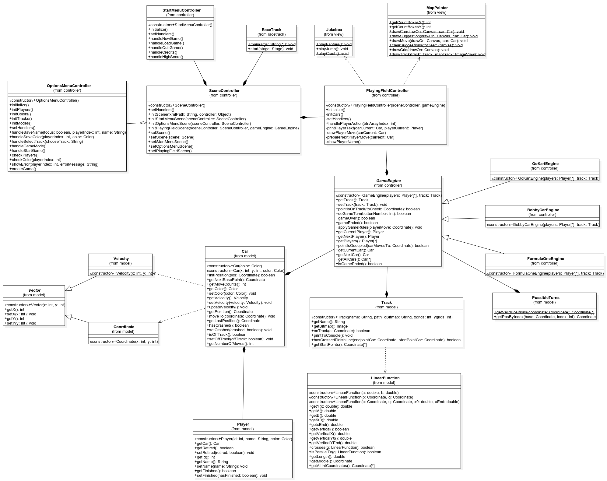

## 5.2. Communication Diagrams

### 5.2.1. Starting the game and showing the main menu

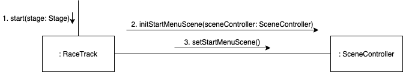

<div style="page-break-after: always;"></div>

### 5.2.2. Starting a new game from the main menu

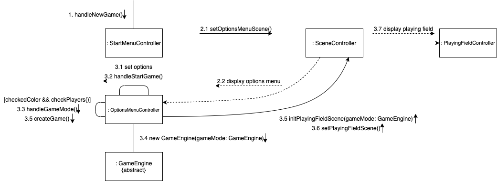

### 5.2.3. Executing a turn in the game

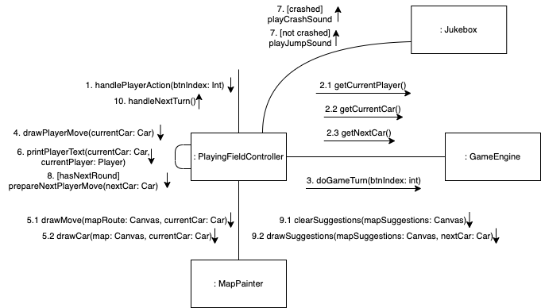

<div style="page-break-after: always;"></div>

### 5.2.4. Last player crosses the finish line

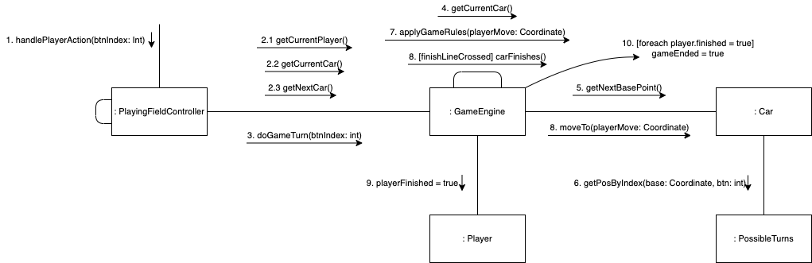

### 5.2.5. Quitting the game from the main menu

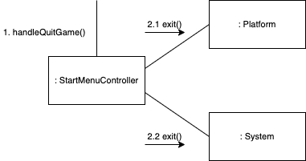

<div style="page-break-after: always;"></div>

# 6. Implementation

## 6.1. Ensuring of Code Quality

RaceTrack is being developed using the leading cloud-based solution for continuous analysis of code quality, reliability and security *SonarCloud*. Not only does *SonarCloud* automatically detect bugs, vulnerabilities, code smells and other issues, it also elevates the team's coding quality to a new standard. 


RaceTrack currently maintains the highest Reliability Rating <span style="color: green"><b>A</b></span>, the highest Security Rating <span style="color: green"><b>A</b></span> and an outstanding Test Coverage of <span style="color: green"><b>86.6%</b></span>, and all of that still during the development of the first prototype, with only room for further improvement.

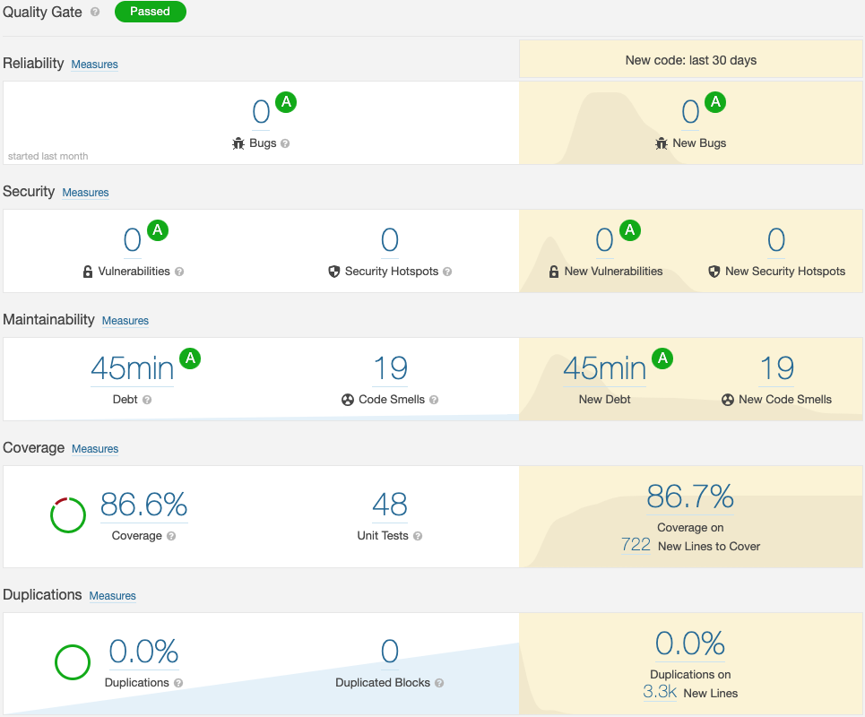

<div style="page-break-after: always;"></div>

In the current build version of RaceTrack, there are currently only 19 *code smells* (code that is confusing or difficult to maintain), of which 18 are about *Todos* still left in the code. The only critical *code smell* is about the method *findFinishLine()*, which has a very high cognitive complexity level, which can be reduced.

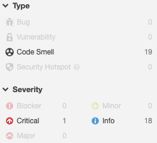

## 6.2. Code Implementation

As described in section *4. Software Architecture*, RaceTrack implements a custom alteration of the MVC Pattern, which can also be taken from the package structure in the source code itself:

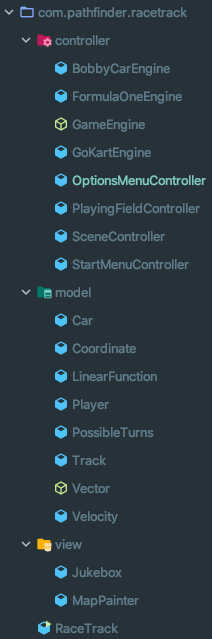

<div style="page-break-after: always;"></div>

### 6.2.1. Package com.pathfinder.racetrack.controller

A *GameEngine* represents the brain of a game session, each game mode (currently three in total) extends the abstract class *GameEngine* with its own extensions. There are currently three game modes available.

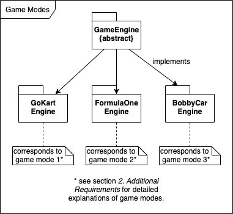

Player input through the GUI is handled by the *controllers*. Each controller is responsible for a different section of the GUI (e.g. *StartMenuController* for input in the main menu), except for the *SceneController*, which manages what menu is currently viewed by the player.

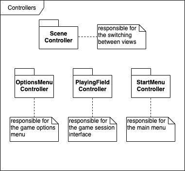

<div style="page-break-after: always;"></div>

### 6.2.2. Package com.pathfinder.racetrack.model

As per layered architecture, the models are being updated through the controller, a *GameEngine* in RaceTrack to be exact. But there are still some connections and dependencies between the models themselves: e.g. *Velocity* and *Coordinate* both extend the abstract class *Vector*, which are used by *Car*, which is also owned by a *Player*.

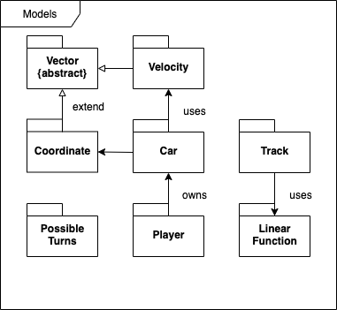

### 6.2.3. Package com.pathfinder.racetrack.view

The *View* package currently only holds the classes *Jukebox* and *MapPainter*, which are both only supporting classes for the actual user interfaces (*Jukebox* for adding sounds effects and *MapPainter* for drawing the playing field).

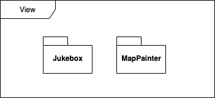

The actual interfaces are being builded by **JavaFX** through *.fxml* files, which are located in the *resources* directory in the source code.

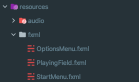

<div style="page-break-after: always;"></div>

## 6.3. Verification

The software architecture has been verified by (partially) implementing both main use cases **UC7 (Play one Game Session)** and **UC13 (Load Track)**. Tracks can only be loaded through the command line at the moment.

## 6.4. Source Code

The complete source code (including Unit Tests) can be found attached to this documentation *Solution-Architecture_PSIT3-FS20-IT18ta_WIN_Team5.zip* or on GitHub (https://github.zhaw.ch/PathFinder/PSIT3-FS20-IT18ta_WIN-Team5).

<div style="page-break-after: always;"></div>

# 7. Project Management

Listing of the rough timeline with previous and future iterations. The planned expenditure and goals are listed together with the actual expenditure and achieved goals per iteration. After each iteration an iteration-assessment is being created, where reached goals are analysed and additional measures may be defined. The detailed planning for next iterations and risks will be constantly updated.

| Phase         | Iteration | Start/Duration[Week] | Goals                                                        | Planned Work[h]                            | Actual Work[h]                      |
| ------------- | --------- | -------------------- | ------------------------------------------------------------ | ------------------------------------------ | ----------------------------------- |
| Inception     | 1         | 1 / 2                | Project draft created, use cases defined, domain model drafted, ~~development pipeline set up finished~~, architecture drafted | 60 h                                       | 50 h                                |
| **Milestone** | **M1**    | **End of week 2**    | **Vision, goals and requirements defined**                   | **Total:**<br />60 h                       | **Total:**<br />50 h                |
| Elaboration   | 2         | 3 / 2                | Use Cases specified in detail, UI prototype present, Use Case Model finished, Domain Model drafted | 60 h                                       | 70 h                                |
|               | 3         | 5 / 2                | UC7 & UC13 first implementation, domain model finalised, System Sequence Diagram finished | 60 h                                       | 70 h                                |
|               | 4         | 7 / 2                | prototype finished, documentation finished, pipeline set upped, architecture stable | -                                          | 40 h                                |
| **Milestone** | **M2**    | **End of week 6**    | **Architecture as PoC verified**                             | **Total:**<br />120 h                      | **Total:**<br />180 h               |
| Construction  | 4         | 7 / 2                | UC7 and UC13 realised and tested, UI prototype implemented   | 80 h                                       |                                     |
|               | 5         | 9 / 2                | UC14, UC4 and UC1 realised and tested, UI updated            | 80 h                                       |                                     |
|               | 6         | 11 / 2               | Use Cases finished implemented, UI updated                   | 80 h                                       |                                     |
| **Milestone** | **M3**    | **End of week 12**   | **Beta Version realised, deployed and released, tests and documentation finished** | **Total:**<br />240 h                      |                                     |
|               |           |                      |                                                              | **Total:**<br />420 h <br />+ 80 h reserve | **Total:**<br />*230 h (currently)* |

<div style="page-break-after: always;"></div>

## 7.1. Construction Phase: 19.04.2020 - 29.05.2020

### 7.1.1. Milestone M3: 29.05.2020

**Start/Duration[Week]:** End of week 14

**Planned Work[h] of Phase:** 240 h

**Actual Work[h] of Phase:** 

**(Achieved) Goals:**

 Beta Version realised and deployed

 Beta Version released

 Finished Tests and Documentation

**Additional Measures:**

 End of project.

### 7.1.2. Iteration 6: 18.05.2020 - 31.05.2020

**Start/Duration[Week]:** 13 / 2

**Planned Work[h]:** 80 h

**Actual Work[h]:** 

**(Achieved) Goals:**

 Use Cases finished implemented

 UI updated

**Additional Measures:**

-

<div style="page-break-after: always;"></div>

### 7.1.3. Iteration 5: 04.05.2020 - 17.05.2020

**Start/Duration[Week]:** 11 / 2

**Planned Work[h]:** 80 h

**Actual Work[h]:** 

**(Achieved) Goals:**

 UC14 realised and tested

 UC4 realised and tested

 UC1 realised and tested

 UI updated

**Additional Measures:**

-

### 7.1.4. Iteration 4: 19.04.2020 - 03.05.2020

**Start/Duration[Week]:** 9 / 2

**Planned Work[h]:** 80 h

**Actual Work[h]:** 

**(Achieved) Goals:**

 UC7 realised and tested

 UC13 realised and tested

 UI prototype implemented

**Additional Measures:**

-

<div style="page-break-after: always;"></div>

## 7.2. Elaboration Phase: 09.03.2020 - 19.04.2020

*Elaboration phase has been extended with an additional iteration because of the ongoing COVID-19 pandemic and Easter holidays.*

### 7.2.1. Milestone M2: 19.04.2020

**Start/Duration[Week]:** End of week 8

**Planned Work[h] of Phase:** 120 h

**Actual Work[h] of Phase:** 180 h

**(Achieved) Goals:**

 Architecture as PoC verified

**Additional Measures:**

 Goal for this milestone has been achieved.

 40 h more used during the additional iteration, but no additional measures needed.

### 7.2.2. Iteration 4: 06.04.2020 - 19.04.2020

**Start/Duration[Week]:** 7 / 2

**Planned Work[h]:** -

**Actual Work[h]:** 40 h

**(Achieved) Goals:**

 Finished prototype

 Finished *Solution Architecture* documentation

 development pipeline set upped

 architecture stable

**Additional Measures:**

 All for this iteration planned goals have been achieved.

 Iteration not part of the original timeline.

<div style="page-break-after: always;"></div>

### 7.2.3. Iteration 3: 23.03.2020 - 05.04.2020

**Start/Duration[Week]:** 5 / 2

**Planned Work[h]:** 60 h

**Actual Work[h]:** 70 h

**(Achieved) Goals:**

 UC7 (Play one Game Session) first implementation realised

 UC13 (Load Track) first implementation realised

 ~~Domain model finalised~~

 System Sequence Diagram finished

**Additional Measures:**

 All for this iteration planned goals have been achieved.

 Domain Model already finalised in last iteration.

 10 h more needed for architecture, but still on time.

### 7.2.4. Iteration 2: 09.03.2020 - 22.03.2020

**Start/Duration[Week]:** 3 / 2

**Planned Work[h]:** 60 h

**Actual Work[h]:** 70 h

**(Achieved) Goals:**

 Use Cases specified in detail

 UI prototype present

 Use Case Model finished

 Domain Model drafted

**Additional Measures:**

 All for this iteration planned goals have been achieved.

 Domain Model already finalised.

 10 h more needed as a lot of design- and architecturial questions needed to be answered. But still on time.

<div style="page-break-after: always;"></div>

## 7.3. Inception Phase: 24.02.2020 - 08.03.2020

### 7.3.1. Milestone M1: 06.03.2020

**Start/Duration[Week]:** End of week 2

**Planned Work[h] of Phase:** 60 h

**Actual Work[h] of Phase:** 50 h

**(Achieved) Goals:**

 Vision defined

 goals defined

 requirements defined

**Additional Measures:**

 All goals for this milestone have been achieved.

 No additional measures need to be taken.

### 7.3.2. Iteration 1: 24.02.2020 - 08.03.2020

**Start/Duration[Week]:** 1 / 2

**Planned Work[h]:** 60 h

**Actual Work[h]:** 50 h

**(Achieved) Goals:**

 Project draft created

 use cases defined

 domain model drafted

 development pipeline set up finished

 architecture drafted

**Additional Measures:**

 Almost all for this iteration planned goals have been achieved.

 Set-up of development pipeline can't be done at the moment, as additional planning still need to be done.

 Goals achieved with 10 hours less than planned.

 Development pipeline will be set upped during the next iteration and shouldn't be a problem, as additional 10 h development time will be taken as a reserve from last iteration.

<div style="page-break-after: always;"></div>

# 8. Glossary

|                     | Description                                                  |
| ------------------- | ------------------------------------------------------------ |
| *PossibleTurn*      | A possible turn (also called *possible move*) is an action a player can take during his turn of a round. Generally a player will be able to choose one out of nine possible actions to take, where his *Car* should be moving to. |
| *GridPaper*         | The overlaying grid put on top of the track during a round of RaceTrack. Players will only be able to move around the grid points provided by the *GridPaper*. |
| *Track*             | The actual track where the cars will drive on. Can be imported by the player from a valid bitmap image. The track defines drivable points, track boundaries and start/finish line. |
| *Start/Finish Line* | Defines the starting and end points of the track.            |
| *Car*               | A players *character*, which will be moved around during a race. Are differentiated by different colors. |
| *Player*            | A player in the game (no NPCs). Each player controls a *Car* during a race. |
| *Route*             | The past moves of each player will represent its car's route. The route will be represented as a trailing line behind each car. |
| .rtsave             | Special file extension for RaceTrack game files containing various game data, e.g. save games or game configurations. |
| NPC                 | Non-playable character. A character which is not controlled by a real human. |
