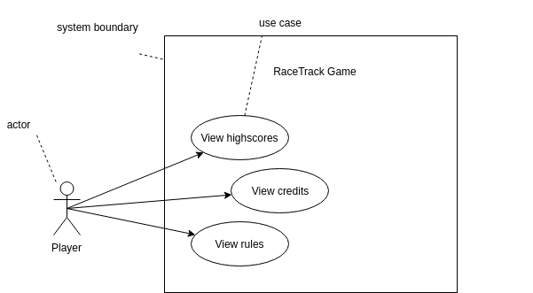

# Use Cases

## Fully dressed Use Case

### Use Case UC1: View Highscore

**Scope:** RaceTrack Game

**Level:** User goal

**Primary Actor:** Player

**Stakeholders and Interests:**

- Player: Wants to have accurate information about the scoreboard of the game.

**Preconditions:** Multiple rounds have already been played (UC7), so it's possible to compare the score of the last round to the other rounds.

**Success Guarantee (or Postconditions):** Previous game scores have been loaded when starting the game

**Main Success Scenario (or Basic Flow):**

1. The player starts the program.
2. The player chooses one of the following options:
   a. She or he plays a round together or alone (UC7), the score will be saved afterwards in the scoreboard.
   b. She or he goes directly to step 3.
3. Player views the highscore board by pressing the "Highscore" button in the main menu.
4. The highscore board opens.
5. The player finds his score on the corresponding position in the highscore board.
6. The player closes the board.
7. The player closes the game (UC8).

**Extensions (or Alternative Flows):**

a.) When the game crashes the following should happen:

- The Player will not see his score in the scoreboard, because the game wasn't finished properly.
- If he chooses to recover the last game, the score should be saved after finishing the recovered game.

b) When the scoreboard file is not existing:

- At the start of the program, the player will be asked if he wants to load an existing scoreboard file from a backup he made.
- Or the player chooses to create a new scoreboard file.

**Special Requirements:**

- The player should be able to easily find his score in the scoreboard.
- The scoreboard must be easy to understand and to read the different scores.

**Technology and Data Variations List:**

- The score is saved in a JSON syntax file.

**Frequency of Occurrence:** When the player hits the "Highscore" button in the menu.

**Miscellaneous:**

- Should the scoreboard be displayed directly after the game is finished?
- Should there be a scoreboard only for the players who were involved in the game that just was finished?

**System sequence diagram:**

```sequence
Game->Player: setPlayersTurn(player)
Player->Game: openHighscoreBoard
Note right of Player: Player sees his score in the highscore board
Game->Player: showHighscoreBoard
Note right of Player: If the highscore board is opened after a game,\nthe score should be displayed
Game->Player: showScoreInHighscore
Player->Game: closeHighscoreBoard

```

## Casual Use Case

### Use Case UC2: View Rules

*Main Success Scenario:* A player starts the program and wants to look at the rules of the game, so he understands how to play the game. The player opens the rule set in the main menu by clicking on the corresponding button. The player should be able to easily understand the aim of the game by reading through the manual.

*Alternate Scenarios:* 

The player wants to play around in the game. He just opens a new round after the program was started.

a) Then he tries to play the game without reading the instructions and successfully plays multiple turns in a row until he's finished playing.

b) Then he tries to play the game without reading the instructions, but won't get how to play it. He terminates the round and gets back to the main menu and carefully reads the instructions.

## Brief Use Case

### Use Case UC3: View Credits

The player starts the program and begins by playing one round. After playing multiple rounds in a row, he wants to know who's the creator of the game and switches back to the main menu. With an easy to find button, he quickly opens the credit dialog and finds the developers and the website of the game. After reading through the story of how the idea came to be, he closes the credit page again and plays on.

## Use Case Diagram



# Domain Model

