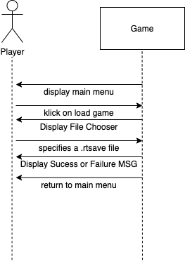
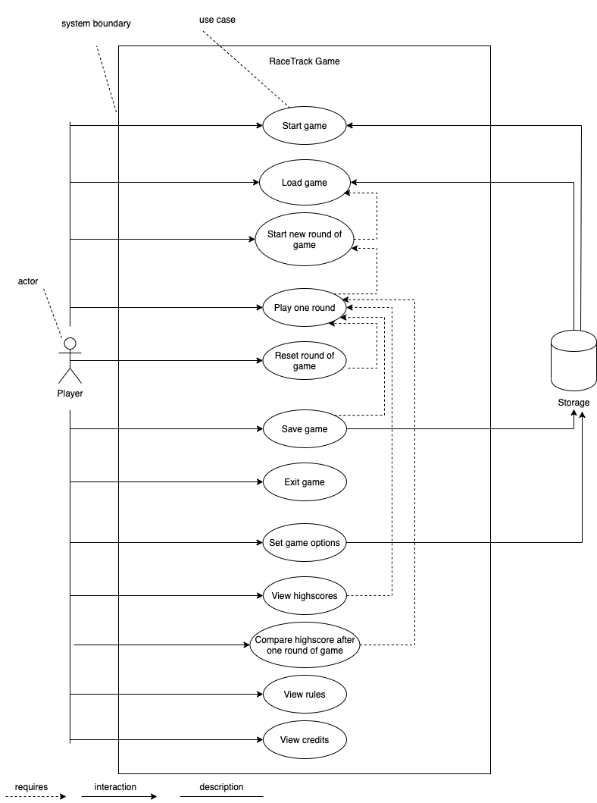

# Use Cases

## Fully dressed Use Case

### Use Case UC10: Load Game

**Scope:** RaceTrack Game

**Level:** user goal

**Primary Actor:** Player

**Stakeholders and Interests:**

- Player: Wants to load a game that was previously saved on the local computer.

**Preconditions:** A file that contains all information, that is required to represent a state of a game. These informations must contain a valid map of a race track. Optionally, this file can contain a list of players, that alread participated in the game and also a list of coordinates where these players already have driven to. The first coordinate has to point on the start line of the track.

**Success Guarantee (or Postconditions):** The above mentioned file needs to be a textfile with the file extension *.rtsave* and it must follow the json syntax.

At the beginning of the *.rtsave* file, there needs to be the definition of the track path. The track is represented by a multiline string, where each line has the exact same length as the previous one. Valid characters are:

* ' ' [space] representing a coordinate that is driveable
* '8' representing non-drivable teritory
* ':' representing the start and finish line

Rigth below the track, there can be player objects. They need to contain a color attribute and a list of coordinates, where the car of the player has already been at. This list needs to have atleast one entry that is pointing to the starting line.

**Main Success Scenario (or Basic Flow):**

1. The game is already started and is in the main menu (UC12).
2. The player opens the 'Load Game' dialogue.
3. The player specifies a file that meets the above mentioned criterias.
4. By confirmation via double klick on the file or by pressing 'ok', the file gets loaded.
5. The application shows a success message and enters the main menu again.

**Extensions (or Alternative Flows):** *None*

**Special Requirements**:

- The 'Load Game' dialogue should use the JFileChooser class, so the user sees a familar dialogue and less explanation is required.
- The user should be able to open the savegame file with a text editor and should be able to see the shape of the track.

**Technology and Data Variations List:**

The *.rtsave* file needs to follow the json syntax for easy handling. XML and YML would also be possible, but are much more complex to implement. Below is a brief example of the contents of a *.rtsave* file.

<div style="page-break-after: always;"></div>

```json
{
	"track": [
		"8888888888888888888888",
		"8888888    :    888888",
		"8888       :      8888",
		"8888       8      8888",
		"8888              8888",
		"8888888         888888",
		"8888888888888888888888"
	],
	"players": [
		{
		"Name": "Bob",
		"Color": "blue",
		"Positions": [
			"13-2",
			"12-3"
		]
	},
	{
		"Name": "Alice",
		"Color": "red",
		"Positions": [
			"13-3",
			"12-4"
		]
	}
	]
}
```

**Frequency of Occurrence:** Usually once per start of the game.

**System Sequence Diagram**:



## Casual Use Case

### Use Case UC11: Save Game

**Scope:** RaceTrack Game

**Level:** user goal

**Primary Actor:** Player

**Stakeholders and Interests:**

- Player: Wants to save a game that hasn't been saved yet.

**Preconditions:** A gameplay session needs to be loaded and there needs to be at least 100 KBytes of free space available in the directory where the save game should be placed.

**Success Guarantee (or Postconditions):** The preconditions must be fullfilled.

**Main Success Scenario (or Basic Flow):**

1. A gameplay session is running.
2. The player switches to the main menu.
3. The player selects 'save game'.
4. The application shows a sucess message.

**Extensions (or Alternative Flows):** *None*

**Special Requirements**:

* The saved gameplay session needs to be loadable as described in use case UC10.
* All information must be saved in one file.
* When the file is loaded again, the gameplay session should excatly be the same.

**Technology and Data Variations List:**

* The resulting file that gets created must have the extension *.rtsave*.
* The resulting file must follow the json syntax described in the use case UC10.

**Frequency of Occurrence:** Expected every time before the application is beeing terminated.

## Brief Use Case

### Use Case UC12: Start Game

**Scope:** RaceTrack Game

**Level:** user goal

**Primary Actor:** Player

**Stakeholders and Interests:**

- Player: Wants to start the application.

**Preconditions:** The Application has to be successfully installed.

**Success Guarantee:** The preconditions must be fullfilled.

**Main Success Scenario:**

The player starts the application by double klicking it or if hes wishes from command line. As the graffical user interface apears all the previously saved options are applied again.

**Special Requirements**:

* The previously saved options shoud be applied automatically.
* If the application is started for the first time, it should start with default options.

## Use Case Diagram



<div style="page-break-after: always;"></div>

# Domain Model


