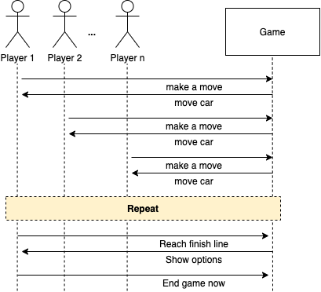
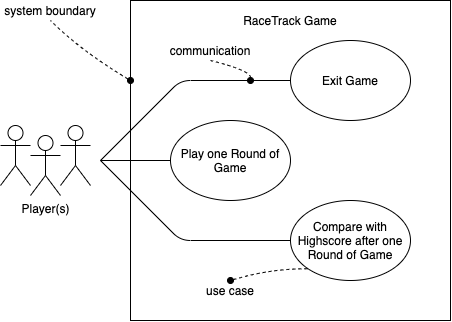

# Use Cases

## Fully dressed Use Case

### Use Case UC7: Play one Round of Game

**Scope:** RaceTrack Game

**Level:** user goal

**Primary Actor:** Player(s)

**Stakeholders and Interests:**

- Player(s): Wants to play one full round of the RaceTrack game, either alone or with a group of people.

**Preconditions:** A game session has been successfully started with the player's configuration (UC12).

**Success Guarantee (or Postconditions):** The game session has been successfully played. Every player has reached the finish line, or the game has been ended after the first player had reached the goal.

**Main Success Scenario (or Basic Flow):**

1. A game session has been successfully started with the player's configuration (UC12).
2. The first player can make his first move.
3. The Player chooses his move for his current turn, based on the given possible moves the player can take. The possibilities are being shown on the track.
4. The player's car moves to the selected position on the track

*Each player repeats steps 3-4 until it's the first player's turn again*

5. The player's next possible moves are being calculated from his previous turn(s).

*Each Player repeats steps 3-5 until every player has reached the finish line*

6. The game session finished and the total scores will be displayed (UC1), with the ability to start a new round of the game (UC5).

**Extensions (or Alternative Flows):**

a.) At any time, a player crashes (driving past track limits):

1. The player's velocity resets.
2. The Player has to start his next turn from the same position.

b.) At any time, a player can drive to a position already occupied by another player:

1. The game calculates the player's possible moves and sees possible positions to take already occupied by another player.
2. The game will not show the invalid move to the player as the next possible move anymore.

c.) After the first player reaches the finish line:

1. The player(s) will be represented with the choice to continue the session until every other player reaches the finish line or to end the game now.

d.) When special items have been selected as an option while starting the game:

1. Special items e.g. boosts, and obstacles are being randomly placed across the track.
2. When driving on to a special item, it's special ability will be activated.

**Special Requirements:**

- Recognizable assets. Cars, track limits, special items, etc. must be easily recognizable.
- The car's movement has to be smooth.

**Technology and Data Variations List:**

- Player input entered by mouse click or keyboard.

**Frequency of Occurrence:** Once when the game session has been started.

**Miscellaneous:**

- ...

**System Sequence Diagram:**

## Casual Use Case

### Use Case UC8: Exit Game

*Main Success Scenario:* The player(s) has finished playing one round of the game and returns to the main menu. After returning to the main menu, the player exits the game by clicking the *Exit Game* entry in the menu.

*Alternate Scenarios:*

While running, the game (application) is being closed by clicking on the *close button* of the application window.

While running, the game's task is being terminated externally (intentionally or unintentionally).

## Brief Use Case

### Use Case UC9: Compare with Highscore after one Round of Game

After one round of the game has finished, the player(s) will be shown the track's current highscore in comparison to the just-finished session. The top ten scores will be shown in addition to the scores of the participated players.

## Use Case Diagram

# Domain Model

