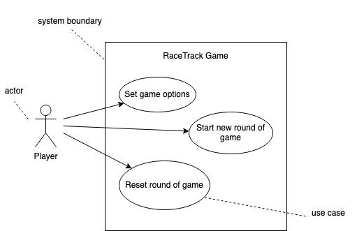

# Use Cases

## Fully dressed Use Case

### Use Case UC4: Set Game Options (after starting game)

**Scope:** RaceTrack Game

**Level:** user goal

**Primary Actor:** Player

**Stakeholders and Interests:**

- Player: Wants to adjust the volume or display scaling of the currently running game session.

**Preconditions:** A game session is already setup and running (UC12). And it would be the player's turn to make a move.

**Success Guarantee (or Postconditions):** Previous preferences and settings have been captured and stored.

**Main Success Scenario (or Basic Flow):**

1. Game finishes the computing of the last move a player has made.
2. Player identifies the option(s) he wants to adjust.
3. Player opens the preferences panel in the game.
4. Player locates the corresponding setting he wants to change.
5. Player makes the change to his choice.
6. Game stores the new value of the configuration made.
7. Game gives feedback, that it was successful.

_Player repeats setps 4-6 until all options he wishes to change are done_

8. Player closes the options panel.
9. Player continues playing the game.

**Extensions (or Alternative Flows):**

a.) At any time, the game fails:

- To support recovery of the game, ensure all game sensitve states and events can be recovered from any step of the scenario.
  - Player restarts the game.
  - Game asks the Player, if he wants to recover the last game session.
    - Player chooses not to recover.
      - Game starts fresh.
    - Player chooses to recover.
      - Game reloads all availiable data from the previous game session.
      - Player continous playing the game.

b.) Resetting all options to default:

- Player wishes to reset all setting in the preferences panel to default.
  - In the options panel, the player resets all settings to the default.

**Special Requirements:**

- Large icons. The location of the settings must be easy to find.
- Language internationalization on the text displayed.

**Technology and Data Variations List:**

- Store the data in JSON format for easy handling.

**Frequency of Occurrence:** Once per round of game at most.

**Miscellaneous:**

- What UI matches the most for a game option panel?

**System Sequence Diagram:**

{ width=450px }

## Casual Use Case

### Use Case UC5: Start new Round of Game

_Main Success Scenario:_ A Player has completed a full round of the game RaceTrack and has arrived at the finish line. The Game prompts him with an option to end the game now or to let the game play out until every other player has reached the finish line. After the game session has ended, the player will be given the chance to start a new round of the game with the same settings as before.

_Alternate Scenarios:_

While a game session is already running and has not ended yet, two players notice that they would like to restart the current game session. During a turn of a player, he opens the options menu and restarts the game. The game then restarts the session with the exact same settings as before.

## Brief Use Case

### Use Case UC6: Reset Round of Game

A player is not satisfied with the current state of the game, based on the moves the player has previously made. To reset his moves and start from the beginning, the player opens the menu of the game. The game then shows him the options he has. The player chooses to "Reset current game". Then the game will ask the player, if he is sure about the action. If he says yes, all elements in the game will be set to the initial state, otherwise, no changes will be made.

## Use Case Diagram

{ width=500px }

# Domain Model

{ width=400px }
